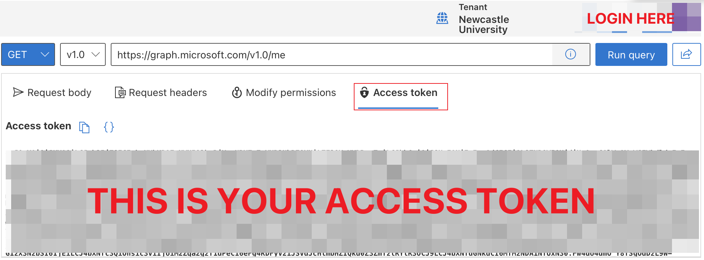

# Microsoft Office 365 Mail Exporter

This project is used to retrieve emails and attachments from the authenticated user's mailbox and save them to the local file system by using the Microsoft Graph API.

I developed this project to address the issue of student accounts being deleted by my university after graduation. To backup the emails, Microsoft suggests downloading the Outlook mail client and syncing all emails from the server. This approach can be cumbersome and inelegant. As an alternative, I created a script that automates the backup process.

## Installation

To use this code, you will need to have Node.js installed. You can then clone this repository and install the necessary dependencies by running:

```bash
pnpm install
```

Using `npm` if you don't have `pnpm` installed.

```bash
npm install 
```

You will also need to set up your Azure AD application and configure it to allow access to the Microsoft Graph API. Refer to [Microsoft's documentation](https://docs.microsoft.com/en-us/graph/auth-register-app-v2) and [Azure Active Directory](https://aad.portal.azure.com/#view/Microsoft_AAD_RegisteredApps/CreateApplicationBlade/quickStartType~/null/isMSAApp~/false) for detailed instructions.

However, not all organizations allow users to create applications. You may encounter an error message like "You don’t have permission to register applications in the YOUR ORGANIZATION directory. To request access, contact your administrator." 

This indicates that it is not possible to obtain the API key by creating an application. Fortunately, there is a simpler way to obtain the API key. Simply navigate to https://developer.microsoft.com/en-us/graph/graph-explorer, log in to your Microsoft account, and click "access token" on the page. Then, copy the token, and you're all set.

**After you got your token ready, put it in the `config/AccessToken` file.**



## Usage

To use this code, run the code by executing:

```
npm run start
```

The program will download the content of your mailbox, including attachments, and store them in the output folder. 

It is worth mentioning that attachments stored in OneDrive or SharePoint will not be downloaded automatically. Instead, the program will log the download link and you will have to click on it manually to download it.

## License

This code is licensed under the MIT License.